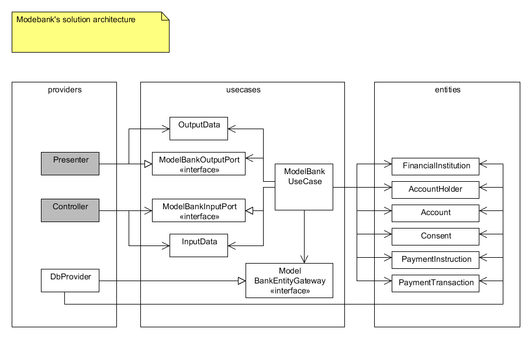

# OpenPSD Modelbank

A model bank used for openpsd purposes.

Make sure you have PostgreSQL installed.

This project uses go-pg.

Note: Work in progress!

## requirements

* Go 1.9.x

Working GO environment is expected as described [here](https://golang.org/doc/code.html#GOPATH) 

## Details

This model bank is used to provide a simple model for processing openPSD request.
It will be proving a very simple payment engine and account holding facility.

